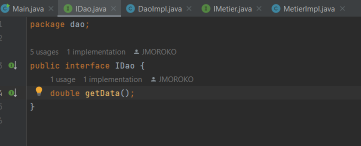
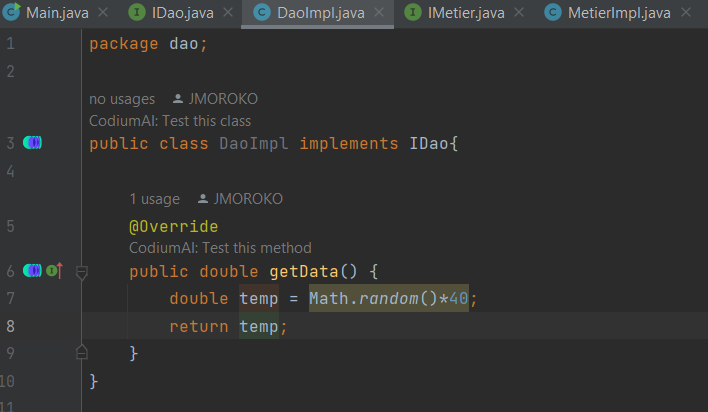
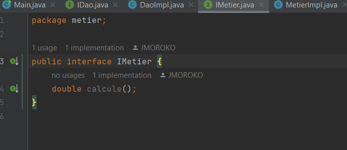
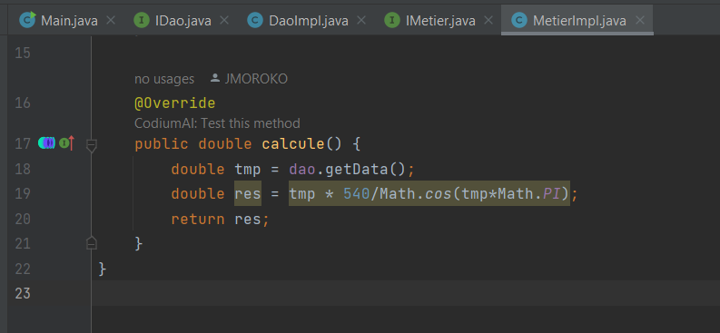
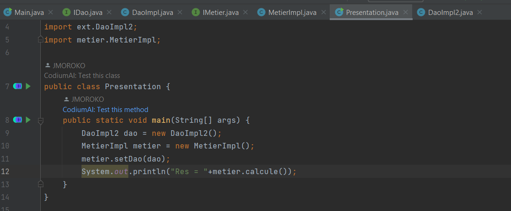

<h2>IBDCC | inversion contrôle et injection dépendance</h2>
<b>DAO</b>

    <b>1- Interface IDAO</b>  
    
    <b>2- DaoImpl</b>  
    

<b>METIER</b>

    <b>3- Interface IMETIER</b>  
    
    <b>4- MetierImpl</b>  
    

<b>5.a- Instanciation statique</b>
